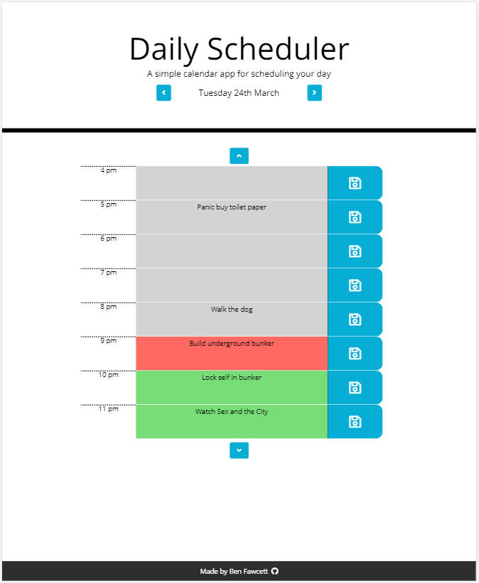

# Daily Planner

[View here](https://hexagonatron.github.io/DailyPlanner/)

## Goal

The goal here was to create a daily planner app that allows the user to save hourly activites and have them persist across page loads using local storage. To make the UX a bit more flashy I decided to investigate and implement css animations to allow the user to scroll through the individual days.

## Screenshot

## Technologies used

* HTML
* CSS
* Javascript
* [Bootstrap](https://getbootstrap.com/)
* [FontAwesome](https://fontawesome.com/)

## Author

Ben Fawcett
